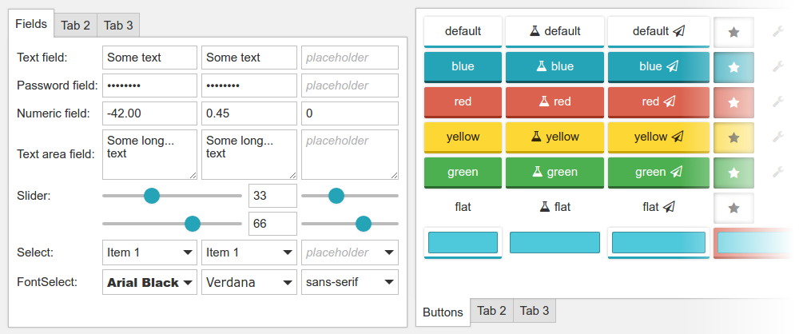

# PhotonUI - A javascript framework to create user interfaces

[](https://travis-ci.org/wanadev/PhotonUI)
[](https://www.npmjs.com/package/photonui)
[](https://github.com/wanadev/PhotonUI/blob/master/LICENSE)
[]()
[]()
[](https://greenkeeper.io/)


PhotonUI javascript framework to create rich web user interfaces without having to manipulate any HTML nor CSS.

* **Website:** http://wanadev.github.io/PhotonUI/
* **Quick start:** http://wanadev.github.io/PhotonUI/doc/quick-start.html




## Getting Started

### Standalone Version

All the files you need are in the `dist` folder. You just have to import

* `photonui-base.css` (must be imported first),
* `photonui-theme-particle.css`,
* and`photonui.js` (or `photonui.min.js`)

in your page:


```html
<!DOCTYPE html>
<html>
    <head>
        <meta charset="UTF-8" />
        <title>Boilerplate</title>
        <meta name="viewport" content="width=device-width, initial-scale=1.0" />

        <link type="text/css" rel="stylesheet" href="dist/photonui-base.css" />
        <link type="text/css" rel="stylesheet" href="dist/photonui-theme-particle.css" />
        <script src="dist/photonui.js"></script>
    </head>

    <body>
    </body>
</html>
```


### NPM and Browserify

If you are using [Browserify][browserify] in your project, a [NPM package][npm]
is available. To install it, juste type:

```
npm install --save photonui
```

then, to use it in your project you just have to import PhotonUI:

```js
var photonui = require("photonui");
```

**NOTE:** do not forget to import CSS files in your HTML page:

```html
<link rel="stylesheet" href="./node_modules/photonui/dist/photonui-base.css" />
<link rel="stylesheet" href="./node_modules/photonui/dist/photonui-theme-particle.css" />
```


## Hacking

PhotonUI is built using [Grunt][grunt], [Less][less] and
[Browserify][browserify]. If you want to hack it, you will have to install few
tools.


### Installing Dependencies

To build PhotonUI, you will first have to install [Node.js][nodejs] (or
[io.js][iojs]).

**NOTE:** If you are on Ubuntu / Debian Linux you must install the
`nodejs-legacy` package.

Next, install globally the `grunt-cli` npm package:

    npm install -g grunt-cli

Then install the PhotonUI's dependencies:

    npm install


### Building PhotonUI

Once the build stuff and dependencies installed, you just have to run the
`grunt` command to build PhotonUI:

    grunt

All generated files are in the `dist` folder.

**NOTE:** during the development, it can be annoying to run the `grunt` command
every time you make a change. You can instead run the following command to
automatically rebuild what changed each time you modify a file:

    grunt watch


### Coding Style

PhotonUI follows the [Yandex Javascript CodeStyle][codestyle-yandex] **EXCEPT**
for the quote marks where we use **double quotes** (`"`).

You can automatically check that your code follows the conventions by using
this command:

    grunt jscs


### Testing

To run the PhotonUI tests, you can use the following commands (you should have
chromium and firefox installed):

    npm test

You can also run manually the tests in your browser:

1. Check that the javascript is well formed and that it follows the coding
   style: `grunt jshint jscs`
2. Build PhotonUI: `grunt`
3. Run the tests: open `test/index.html` in your browser.


### Git Hooks

To avoid committing bad stuff, you can install a git pre-commit hook that will
abort the commit if the code contains errors. To install the hooks you just
have to run the following command:

    grunt githooks


### Creating Your Own widgets

If you want to create you own PhotonUI widgets, first read this:

* http://wanadev.github.io/PhotonUI/doc/custom-widget.html

The documentation above explain how to create a custom widget **outside** of the PhotonUI project.

Once you feel comfortable with the custom widget creation, you can create
widgets inside the PhotonUI project. We created a [Yeoman][yo] generator that
creates all required files for you:

* https://github.com/wanadev/generator-photonui-widget


## Related projects:

* [photonui-site](https://github.com/wanadev/photonui-site): The PhotonUI's site
* [generator-photonui-widget](https://github.com/wanadev/generator-photonui-widget): The PhotonUI widget generator


## Changelog:

* **1.7.2:**
  * New event on ColorPicker: `value-changed-final` called when the value is no more modified after continuous changes

* **1.7.1:**
  * Dependencies updated (uuid 2.0.3 → 3.0.0)

* **1.7.0:**
  * `photonui.Color` improved: it can now import/export colors from/to many format
  * Dependencies updated

* **1.6.4:**
  * Fields new event: `value-changed-final` called when the value is no more modified after continuous changes

* **1.6.3:**
  * Fixes an issue when unregistering a callback in `photonui.AccelManager` (#73)
  * Fixes translation not updated on selected elements of `photonui.Select` widget (#71)
  * Fixes absolute widget calculation (partially fixes #70)

* **1.6.2:**
  * Fixes regression in the `photonui.ColorPicker` widget (#68)

* **1.6.1:**
  * Fixes wrong import path of fontawesome files when importing photonui less files from the module.

* **1.6.0:**
  * New widget: `photonui.Expander` (thx @Breush),
  * `Base.prototype._updateProperties()` is now deprecated: the `@photonui-update` annotation replaces it (#55),
  * Various fixes (issue #51, issue #58, issue #60, PR #53,...).

* **1.5.1:**
  * Fixes an issue with `FileManager`,
  * cleanup build / test dependencies

* **1.5.0:**
  * New widget: `photonui.KeyboardManager` (thx @Breush)

* **1.4.1:**
  * various fixes

* **1.4.0:**
  * New widgets: `Template`, `IconButton`,
  * All widgets have now a `data` property that can contain anything you want,
  * Font Awesome updated to 4.5

* **1.3.0:**
  * Fixes vertical sizing issue in GridLayout with latest Gecko versions...
  * Better split of Less files

* **1.2.1:**
  * Fixes minor display issues

* **1.2.0:**
  * TabItem can now have icons
  * Touch support on Window and Slider
  * Window: fullscreen option added
  * Fixes "click" wEvent triggered twice on ToggleButton (issue #17)
  * Translation abstraction added to MouseManager
  * FluidLayout: re-implemented using CSS flexbox, new properties and layoutOptions available,
  * Stone.js updated

* **1.1.0:**
  * Classy replaced by Abitbol
  * Scaling support added to MouseManager
  * "click" wEvent added to TabItem

* **1.0.1:**
  * Fixes (GridLayout exception on some edge cases, flat ToggleButton theme)
  * Optimizations (destroying a layout widget)

* **1.0.0:**
  * First release


[browserify]: http://browserify.org/
[npm]: https://www.npmjs.com/package/photonui
[grunt]: http://gruntjs.com/
[less]: http://lesscss.org/
[nodejs]: https://nodejs.org/
[iojs]: https://iojs.org/
[phantomjs]: http://phantomjs.org/
[yo]: http://yeoman.io/
[codestyle-yandex]: https://github.com/yandex/codestyle/blob/master/javascript.md

